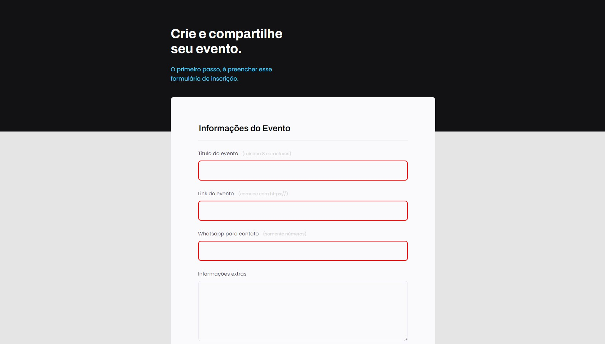

## 💻 Projeto

Este projeto foi feito no treinamento do Explorer da Rocketseat, para ensinar os fundamentos da criação de um formulário em HTML, a utilização de pseudo-class e pseudo-element, tipos de input e validações utilizando apenas o HTML. Foi muito bom para rever e tirar muitas dúvidas.

 
 

  

 

## 🎯 Deploy
Veja o site publicado [clicando aqui](https://allanfrancis.github.io/Explorer-Projeto-04/).
 
 

## 🚀 Tecnologias
Esse projeto foi desenvolvido com as seguintes tecnologias:
- HTML e CSS
- VS Code
- Git e Github
- Figma
 
 

## 🔖 Layout

Para visualizar o projeto no figma, basta [clicar aqui](https://www.figma.com/file/3KxtHcmh4ZRbtwZqBZec2K/Explorer-Stage-03-Projeto-01-(Copy)?node-id=0%3A1&t=fPc1xcu25ffkcyhA-0). É necessário ter conta no [Figma](https://figma.com) para acessá-lo.